<div align="center">

# ⚙️ Ashrith Balaji Gudla — Backend Engineer Portfolio

### Java • Spring Boot • Microservices • Event-Driven Systems • AI-Enabled Backends

<a href="https://portfolio-coral-beta-d549q6au8t.vercel.app/">
  
</a>

<br/><br/>


<br/>


<br/><br/>

<a href="https://portfolio-coral-beta-d549q6au8t.vercel.app/">🌐 Live Portfolio</a>
&nbsp;&nbsp;•&nbsp;&nbsp;
<a href="https://github.com/ashrithBalaji456/Portfolio">📦 Source Repository</a>

</div>

---

## 📌 About This Portfolio

This repository contains my personal engineering portfolio: an interactive, animation-rich showcase of my work as a **Java and Spring Boot backend developer**.

The portfolio is structured around my actual technical direction:

> **Java → Spring Boot → REST APIs → Security → Databases → Microservices → Kafka → Docker → AI Integrations**

It is not only a résumé page. It is a complete professional experience that presents my technical stack, backend projects, startup concept, experience, education, certifications, research, coding profiles, achievements, and direct contact channels.

The portfolio itself uses a lightweight Vite-powered frontend with custom HTML, CSS, and JavaScript interactions, including canvas animation, scroll reveals, counters, project filtering, card tilt, magnetic interactions, a technology marquee, and responsive navigation.

---

## 🌐 Live Portfolio

<div align="center">

<a href="https://portfolio-coral-beta-d549q6au8t.vercel.app/">
  
</a>

</div>

---

## ✨ Portfolio Highlights

- Backend-engineer-focused personal branding
- Animated hero with canvas background
- Profile portrait with entrance and floating animations
- Dynamic coding/project statistics counters
- Infinite technology marquee
- Backend architecture visualization
- Technical skills grid
- Filterable project showcase
- Dedicated startup idea section
- Experience timeline
- Education timeline
- Certification showcase
- Research/publication section
- Coding profile cards
- Achievement cards
- Resume access
- GitHub, LinkedIn, and email actions
- Scroll progress indicator
- Cursor aura interaction
- Magnetic buttons
- 3D tilt cards
- Scroll reveal animations
- Responsive mobile navigation
- Glassmorphic visual system
- Vercel deployment

---

## 🏗️ Portfolio Architecture

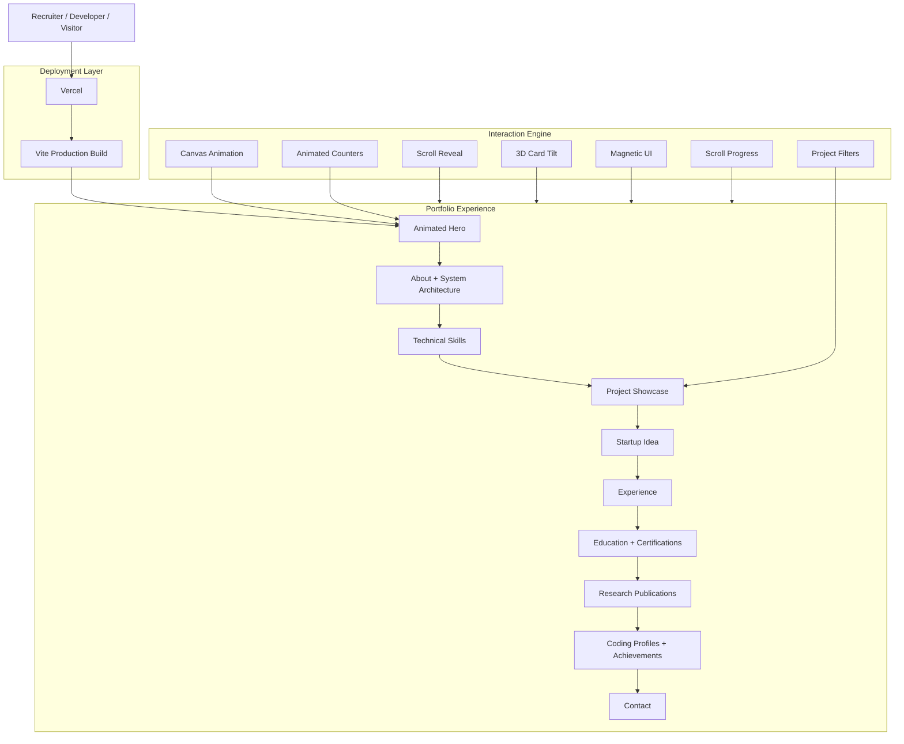

---

## 🔄 Complete Visitor Workflow

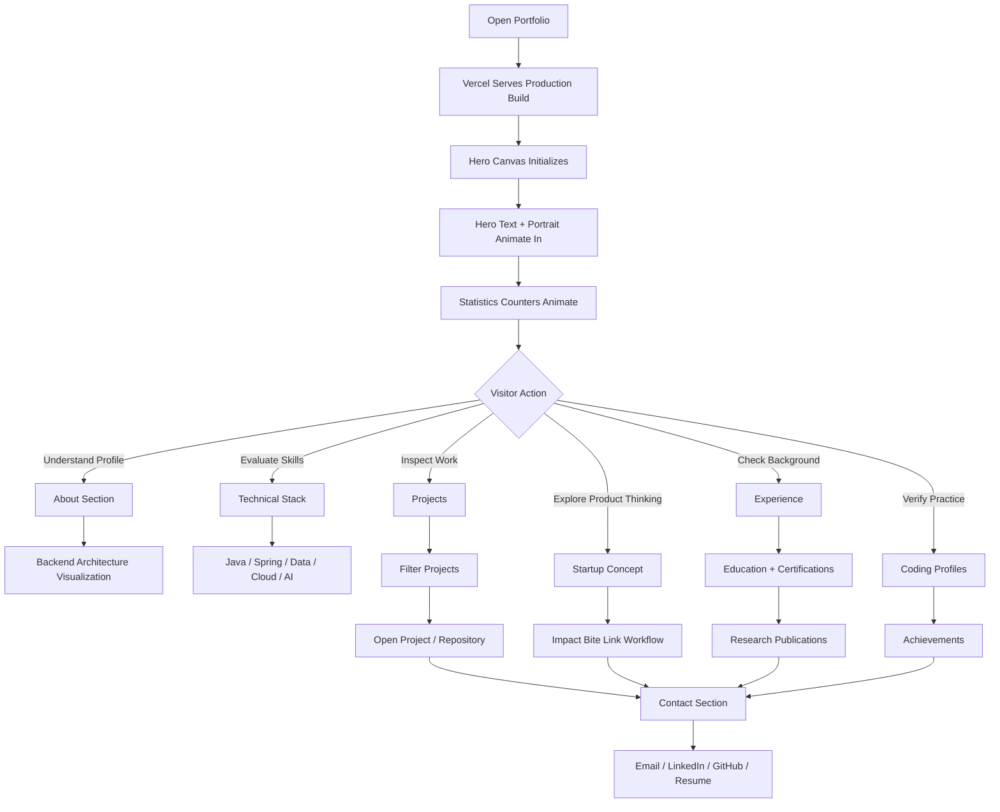

---

## 🦸 Hero Experience

The hero is designed to establish my engineering identity immediately.

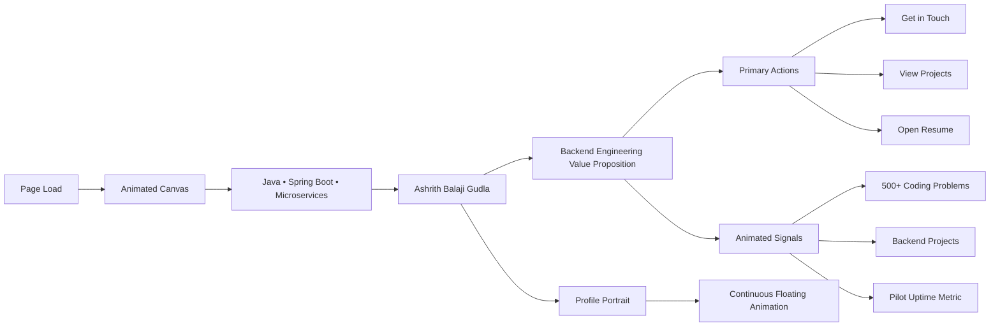

The latest UI removes unnecessary simulated backend-console text from the hero and keeps attention on the actual profile, portrait, CTAs, and measurable signals.

---

## 🧭 Navigation Flow

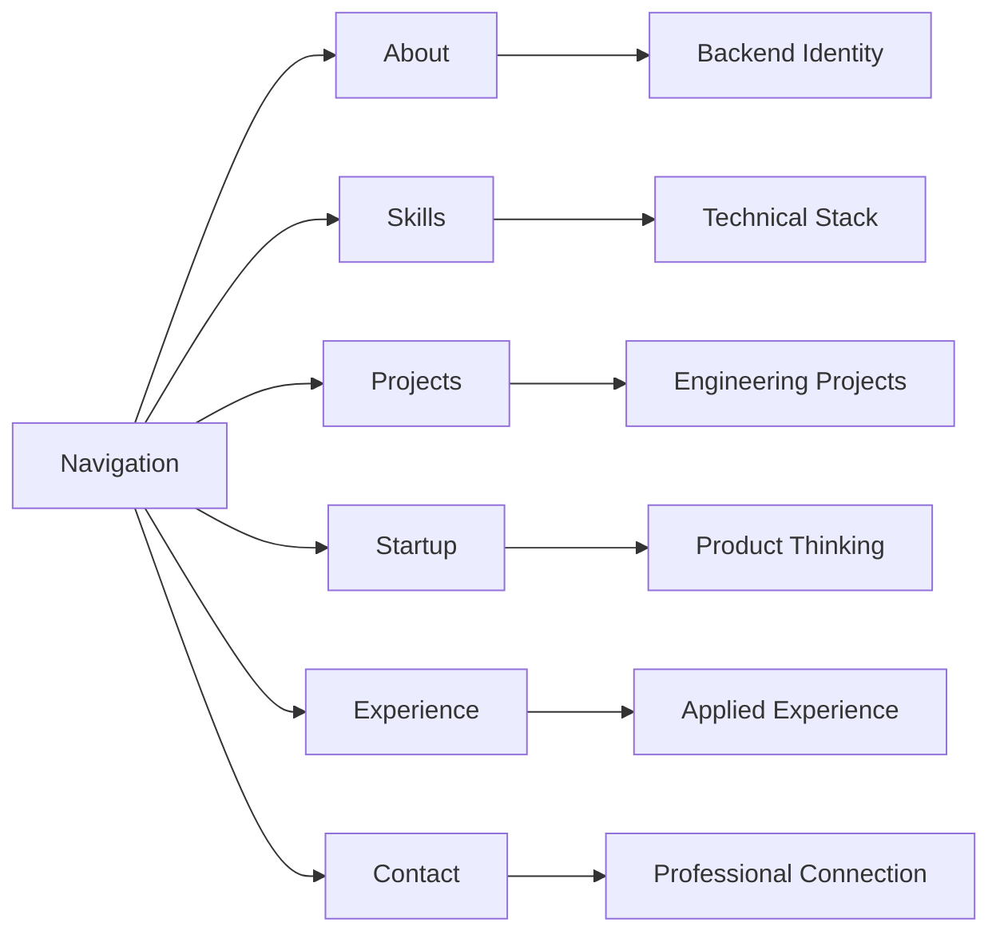

---

## 🧠 About Section — Backend System Thinking

The About section visually communicates how my preferred backend technologies work together.

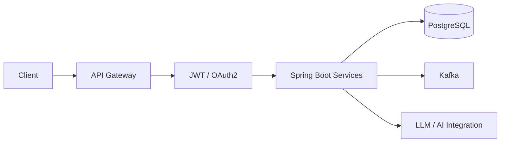

The portfolio emphasizes reliable backend foundations: modular APIs, service discovery, authentication, data stores, automation, event-driven communication, and AI-enabled services.

---

## 🛠️ Technical Stack

| Area | Technologies |
|---|---|
| Backend | Java, Spring Boot, Spring MVC |
| APIs | REST APIs, API Gateway |
| Security | JWT, OAuth2, Keycloak concepts |
| Microservices | Spring Cloud patterns, service discovery |
| Messaging | Apache Kafka |
| Relational Data | PostgreSQL, MySQL |
| NoSQL | MongoDB |
| Containers | Docker |
| AI Integration | Gemini API, LLM evaluation concepts |
| Frontend Exposure | HTML, CSS, JavaScript, React |
| Tools | Git, GitHub, Maven, Postman |

---

## 🧩 Skills Discovery Workflow

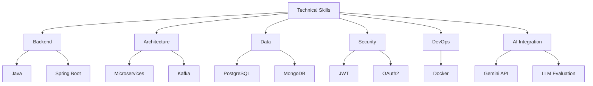

---

## 📦 Project Showcase Workflow

The project section is built to support quick technical evaluation.

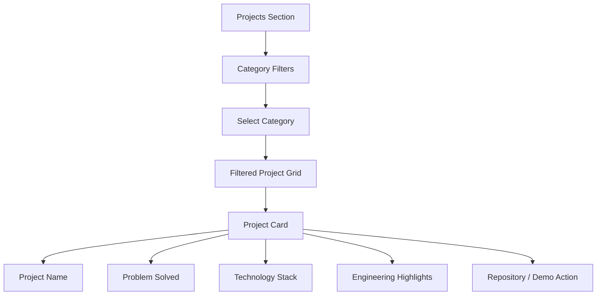

### Project Evaluation Path

```text
Project Name
     ↓
Problem / Use Case
     ↓
Architecture
     ↓
Backend Technologies
     ↓
Security / Data / Messaging
     ↓
Repository or Live Demo
```

This approach makes the portfolio useful for technical interviewers who want to understand engineering depth quickly.

---

## 🚀 Startup Idea — Impact Bite Link

The portfolio contains a dedicated startup-thinking section around a social-impact delivery concept.

```mermaid
flowchart LR
    LOGIN[Customer Login] --> OCCUPATION[Capture Occupation Signal]
    OCCUPATION --> MATCH[Match Relevant Verified Candidates]
    MATCH --> ATTACH[Attach 1–2 Profiles to Order]
    ATTACH --> QR[QR Code / In-App Card]
    QR --> VIEW[Professional Views Candidate]
    VIEW --> REFERRAL[Potential Referral / Opportunity]
    REFERRAL --> IMPACT[Employment Visibility + Social Impact]
```

### Value Loop

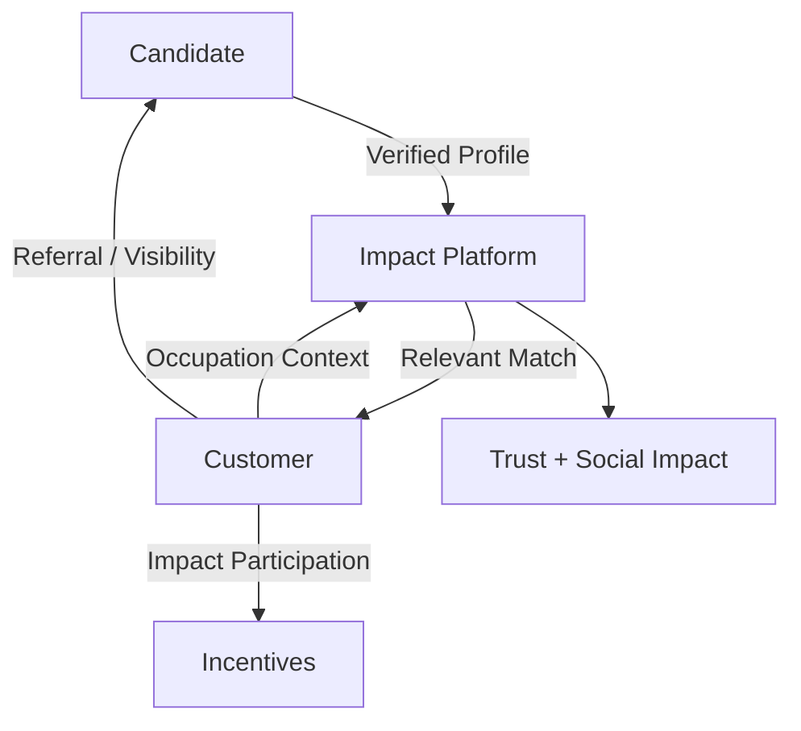

The idea focuses on **relevance over résumé noise**: placing a small number of relevant profiles in front of potentially useful professional connections.

---

## 💼 Experience Workflow

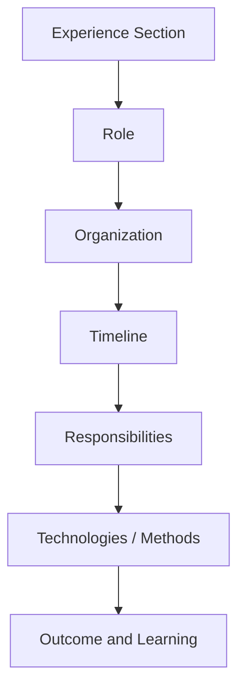

The portfolio presents experience alongside backend engineering practice and AI evaluation exposure.

---

## 🎓 Education & Certification Journey

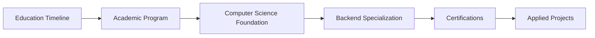

---

## 📚 Research & Publication Flow

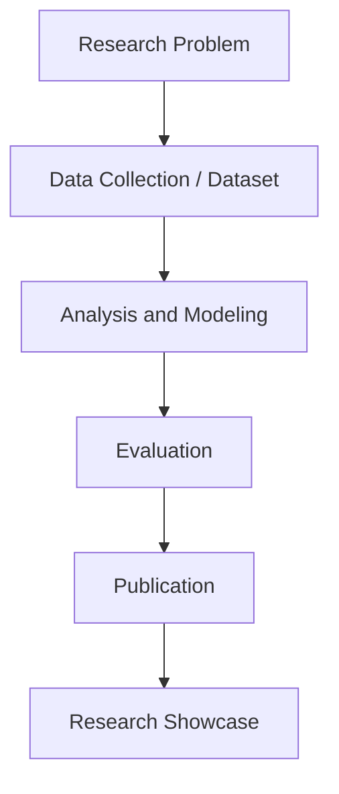

The portfolio includes a dedicated research section so academic work is separated from application projects while remaining part of the complete engineering profile.

---

## 🧪 Proof of Work

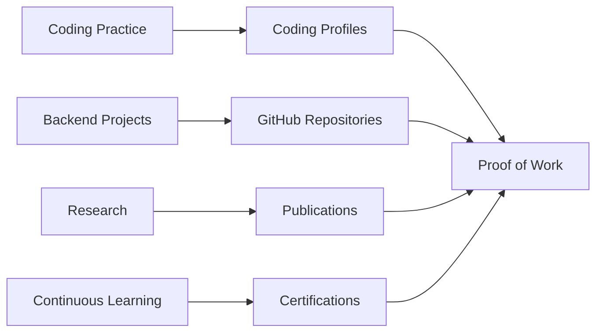

---

## 🎨 Interaction & Animation Engine

The portfolio uses custom interactions instead of relying only on static cards.

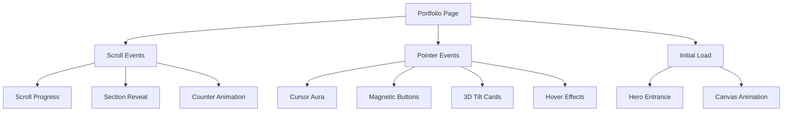

### Animation Features

- Hero text entrance
- Portrait entrance and floating motion
- Hero statistics entrance
- Scroll reveal
- Animated counters
- Canvas background
- Ambient mesh layers
- Liquid orbit visuals
- Scan-field effect
- Infinite technology marquee
- Magnetic interactions
- 3D tilt cards
- Cursor aura
- Scroll progress bar

---

## ⚡ Frontend Runtime Flow

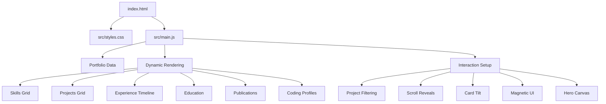

---

## 📱 Responsive Workflow

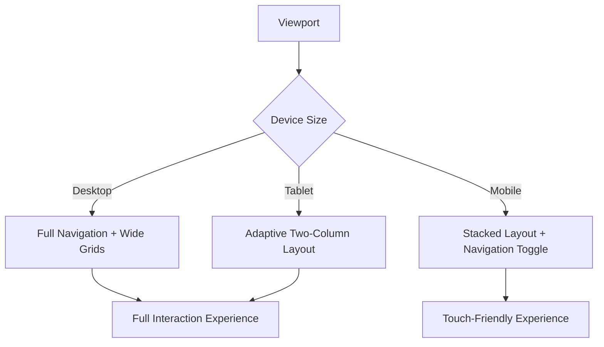

---

## 📂 Project Structure

```text
Portfolio/
│
├── index.html
│
├── src/
│   ├── main.js
│   └── styles.css
│
├── assets/
│   ├── profile image
│   └── resume PDF
│
├── package.json
├── package-lock.json
├── vite.config.*
├── .gitignore
└── README.md
```

---

## 🚀 Run Locally

### Clone

```bash
git clone https://github.com/ashrithBalaji456/Portfolio.git
cd Portfolio
```

### Install Dependencies

```bash
npm install
```

### Start Development Server

```bash
npm run dev
```

The terminal will show the local Vite URL, typically:

```text
http://localhost:5173
```

### Production Build

```bash
npm run build
```

### Preview Build

```bash
npm run preview
```

---

## 🌍 Deployment Workflow

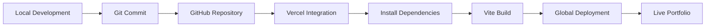

**Production:** `portfolio-coral-beta-d549q6au8t.vercel.app`

---

## 🎯 Recruiter Journey

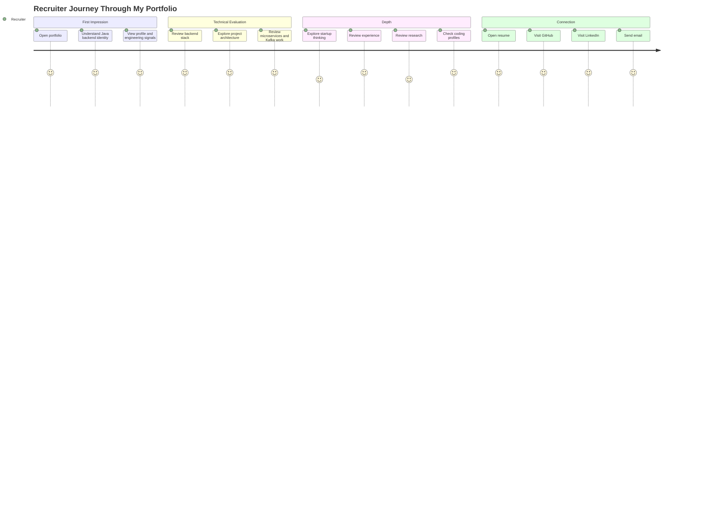

---

## 🧪 Testing Checklist

- [ ] Live deployment loads correctly.
- [ ] Hero canvas initializes.
- [ ] Hero text animation plays.
- [ ] Profile portrait loads correctly.
- [ ] Portrait floating animation works.
- [ ] Counter animations start correctly.
- [ ] Resume opens successfully.
- [ ] GitHub action opens the intended profile.
- [ ] LinkedIn action opens the intended profile.
- [ ] Email action opens the mail client.
- [ ] Navigation scrolls to correct sections.
- [ ] Technology marquee loops smoothly.
- [ ] Skill cards render correctly.
- [ ] Project filters update the project grid.
- [ ] Project links work.
- [ ] Startup demo link works.
- [ ] Experience timeline renders correctly.
- [ ] Education and certification cards display.
- [ ] Publication cards display.
- [ ] Coding profile links work.
- [ ] Scroll progress updates.
- [ ] Reveal animations trigger correctly.
- [ ] Magnetic interactions work on pointer devices.
- [ ] Tilt effects work on supported devices.
- [ ] Mobile navigation opens and closes.
- [ ] Layout works on desktop, tablet, and mobile.
- [ ] No horizontal overflow appears.
- [ ] Production build succeeds.

---

## 🧠 Engineering Concepts Demonstrated

This portfolio demonstrates:

- Vite-based frontend architecture
- Semantic HTML structure
- Modular CSS organization
- Vanilla JavaScript DOM rendering
- Data-driven UI generation
- Event-driven interactions
- Canvas animation
- Intersection-based reveal patterns
- Animated counters
- Project filtering
- Responsive navigation
- Pointer-aware interactions
- 3D transform effects
- Progressive enhancement
- Responsive layout design
- SEO metadata
- Accessibility labels
- Production deployment with Vercel

More importantly, the content demonstrates my focus on:

- Java backend development
- Spring Boot REST APIs
- Microservices architecture
- API Gateway patterns
- authentication and authorization
- event-driven communication with Kafka
- relational and NoSQL databases
- Docker-based development
- AI-enabled backend integrations
- backend project architecture

---

## ♿ Accessibility Considerations

The portfolio already uses semantic sections and ARIA labels in interactive areas. Future accessibility improvements can include:

- complete keyboard-navigation audit,
- stronger focus-visible states,
- reduced-motion mode,
- color-contrast validation,
- screen-reader testing,
- descriptive project-link labels,
- automated accessibility checks in CI.

Recommended reduced-motion behavior:

```css
@media (prefers-reduced-motion: reduce) {
  *,
  *::before,
  *::after {
    animation-duration: 0.01ms !important;
    animation-iteration-count: 1 !important;
    scroll-behavior: auto !important;
  }
}
```

---

## ⚡ Performance Strategy

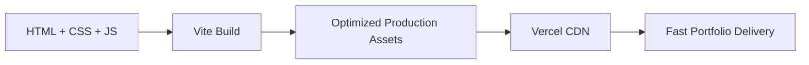

Recommended continuous improvements:

- optimize portrait and project images,
- use WebP/AVIF where practical,
- lazy-load below-the-fold images,
- minimize unused JavaScript,
- respect reduced-motion preferences,
- run Lighthouse before major releases,
- add performance budgets to CI.

---

## 🔐 Production Considerations

- Add a custom domain.
- Add Open Graph metadata.
- Add Twitter/X social cards.
- Add Content Security Policy headers.
- Add privacy-aware analytics.
- Add automated link checking.
- Add Lighthouse CI.
- Add accessibility testing.
- Add deployment checks with GitHub Actions.
- Keep private service credentials out of frontend code.
- Add spam protection if a server-backed contact form is introduced.

---

## 🗺️ Future Roadmap

- [ ] Custom domain
- [ ] Open Graph preview card
- [ ] Dynamic GitHub repository statistics
- [ ] GitHub contribution visualization
- [ ] Individual project case-study pages
- [ ] Architecture diagrams per project
- [ ] Technical blog section
- [ ] Project search
- [ ] Project filtering by Java / Microservices / AI / Full Stack
- [ ] Dark/light theme switcher
- [ ] Reduced-motion accessibility mode
- [ ] PWA support
- [ ] Analytics dashboard
- [ ] Serverless contact form
- [ ] CAPTCHA protection
- [ ] Lighthouse CI
- [ ] Automated accessibility audit
- [ ] Broken-link checking
- [ ] GitHub Actions deployment validation
- [ ] Dynamic publication metadata

---

## 🔗 Important Links

| Resource | Destination |
|---|---|
| 🌐 Live Portfolio | `https://portfolio-coral-beta-d549q6au8t.vercel.app/` |
| 📦 Portfolio Repository | `https://github.com/ashrithBalaji456/Portfolio` |
| 💼 LinkedIn | `https://www.linkedin.com/in/ashrithgudla/` |
| 📧 Email | `ashrithbalajigudla@gmail.com` |

---

## 👨‍💻 Developer

<div align="center">

### Ashrith Balaji Gudla

**Java Backend Developer | Spring Boot | Microservices | REST APIs**

Building scalable backend applications, event-driven services, secure APIs, data systems, and AI-enabled backend integrations.

</div>

---

## ⭐ Support

If this portfolio or its interaction design helps you build a stronger developer portfolio, consider starring the repository.

<div align="center">

### Built around ☕ Java • 🌱 Spring Boot • 🧩 Microservices • 📨 Kafka • 🐘 PostgreSQL • 🐳 Docker

**Design systems. Build APIs. Ship reliable software.**

⭐ Star the repository if you find it useful.

</div>
